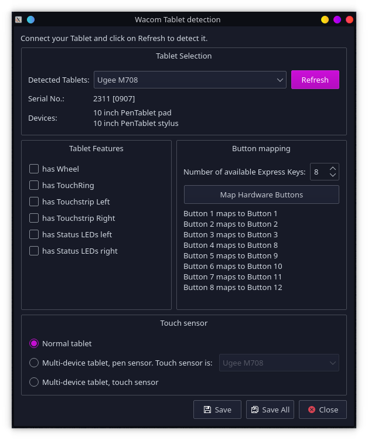

# hid_m708 

This is a Linux driver for the Ugee M708 drawing tablet using DKMS. It integrates with the KDE tablet tools and supports the barrel keys, button pad and pressure.



## Installation

```bash
git clone https://github.com/ezhang-dev/hid_m708.git
cd hid_m708
make
sudo make dkms_install
echo tabletdblocalrc >> ~/.config/tabletdblocalrc
```

## Uninstallation

```bash
sudo make dkms_uninstall
```

## Credits

HID Driver Skeleton is based off the [DIGImend](https://github.com/DIGImend) project.